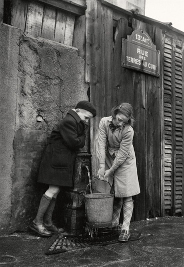

# History #

**Rue des Terres-au-Curé**, located in Paris's 13th arrondissement, has a rich history that reflects the evolution of its neighborhood.

**Origins and Early History**

Originally part of the commune of Ivry, the area now known as Rue des Terres-au-Curé was once expansive fields owned by a priest, which led to its name translating to "Land of the Priest." The extensive nature of these lands necessitated granting passage rights to local residents. This pathway was documented on the 1812 cadastral plan as the "chemin de la Coupe-des-Terres-au-Curé."

**Integration into Paris and Urban Development**

In 1863, the street was incorporated into Paris's road network. The construction of the Petite Ceinture railway subsequently divided the original path into two sections. The portion leading to what is now Boulevard Masséna became known as "Square Masséna," while the remaining section was officially named "Rue des Terres-au-Curé" on February 1, 1877.

**The more general transformation of the 13th Arrondissement**

The 13th arrondissement itself has undergone significant transformations. Once an industrial suburb, it was annexed by Paris in 1860. The area was known for its woods, fields, and mills, and in the 14th century, it became a manufacturing hub due to the Bièvre River, which provided essential water resources.

In the 16th century, the Gobelin family established dyeing workshops in the area, leading to the renowned Manufacture des Gobelins tapestry factory. This industrial activity attracted workers and contributed to the neighborhood's development.

In the latter half of the 20th century, the arrondissement experienced further changes with urban renewal projects, including the "Italie 13" initiative inspired by Le Corbusier's urban theories. This project aimed to reshape areas around Butte-aux-Cailles, Rue Nationale, and Boulevard Vincent-Auriol, resulting in the construction of several high-rise buildings, particularly in the Olympiades district.

*Children fetching water from the fountain, Rue des Terres-au-Curé, Paris 13th district, © Sabine Weiss, 1954.*

**Modern-Day 13th Arrondissement**

Today, the 13th arrondissement is a vibrant and diverse area, home to Paris's main Asian district and modern developments like the Paris Rive Gauche project. The neighborhood seamlessly blends its historical roots with contemporary urban life.

**Historical Significance of Artist's Home**

The place you are enjoying is a residence on Rue des Terres-au-Curé, originally built in the early 20th century, once served as an electricity shop. The shop occupied the left side of the building (now the ground-floor room), while the hangar, which served as a storage area, has since been an atelier d'artiste and further transformed into the living room. The residential part of the house was located at the back of the courtyard, now home to the kitchen and upper levels.

In 1996, the space became an artist's studio (Atelier d'artiste), a role it maintained until 2008. In 2023, its artistic spirit was revived, restoring the creative essence of its past.

These history highlights show the dynamic evolution of Rue des Terres-au-Curé and its surrounding neighborhood, showcasing a blend of historical significance and modern development. 
